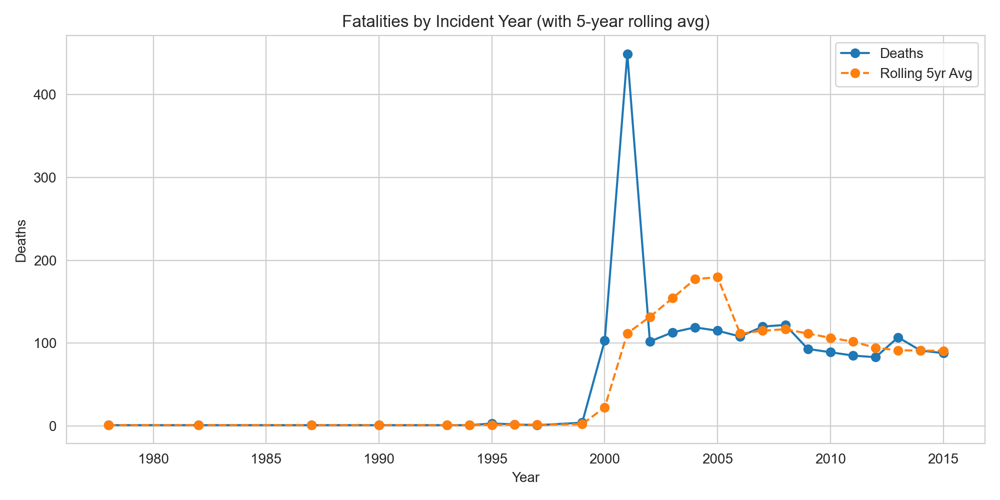
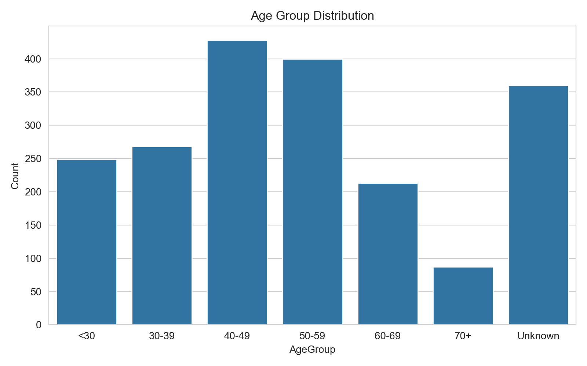
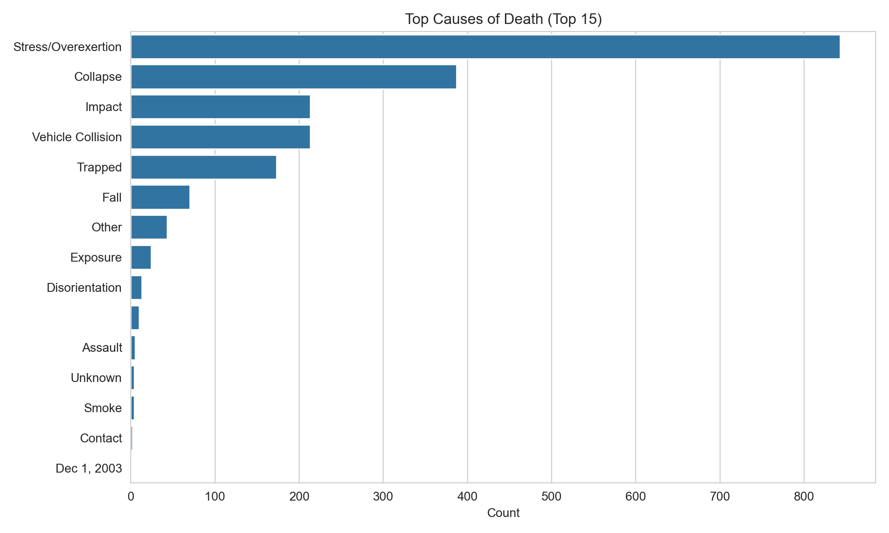
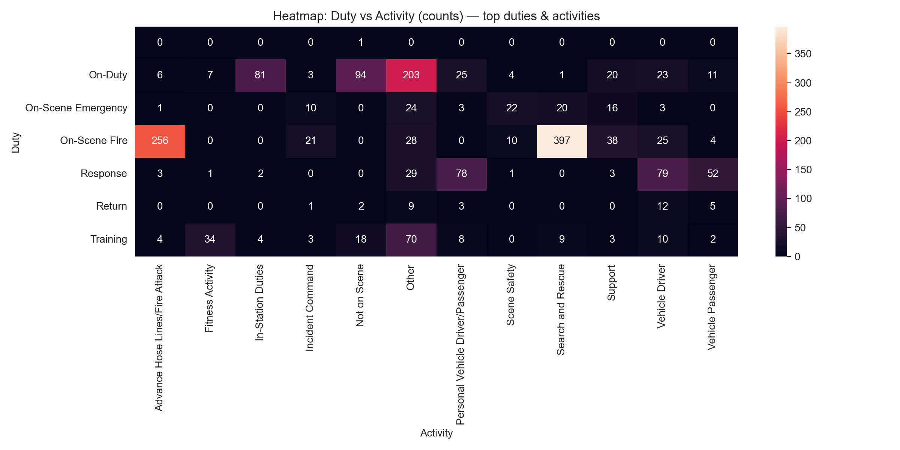
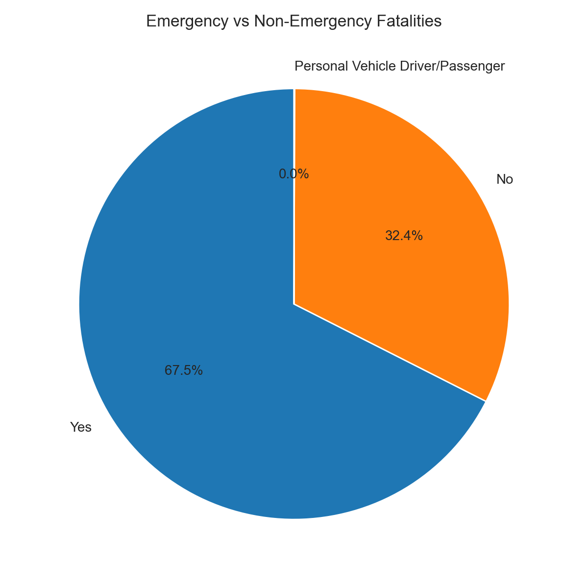
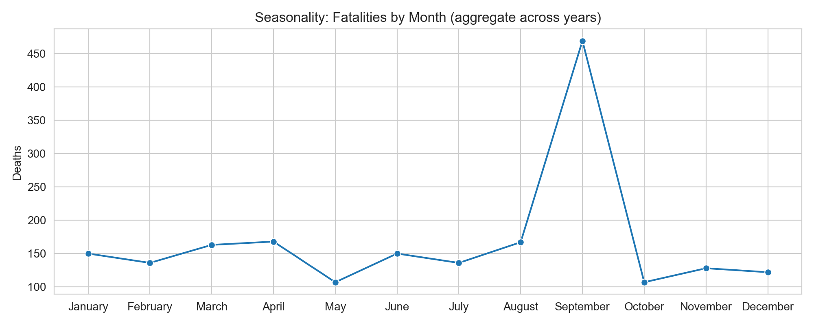
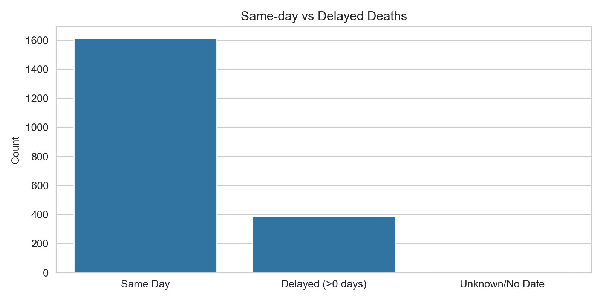
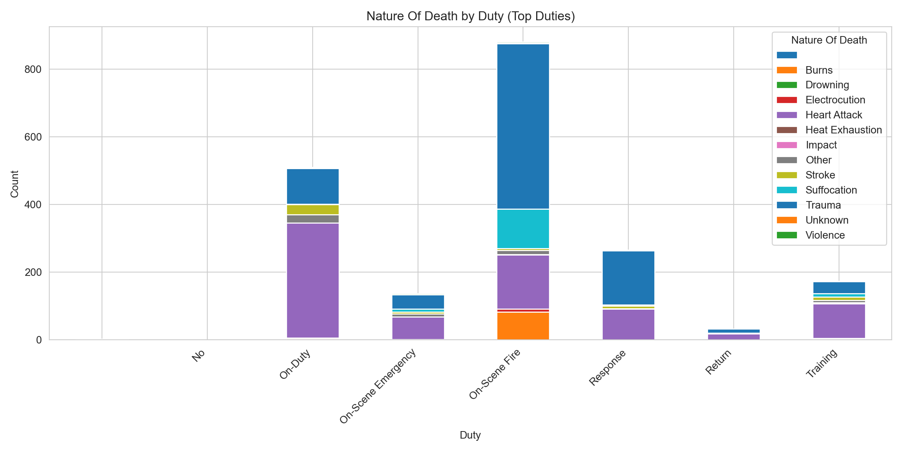
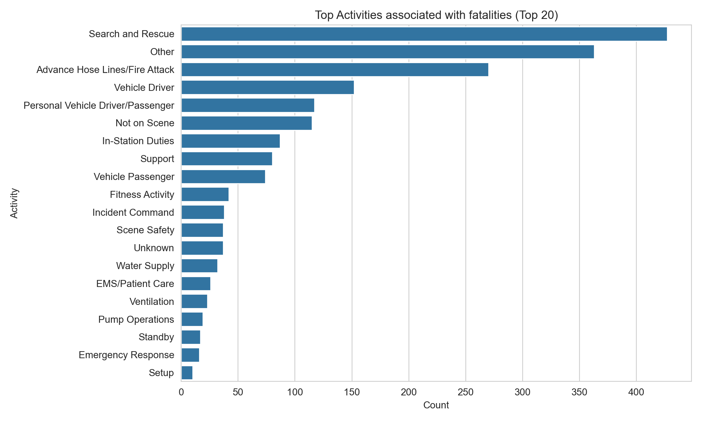
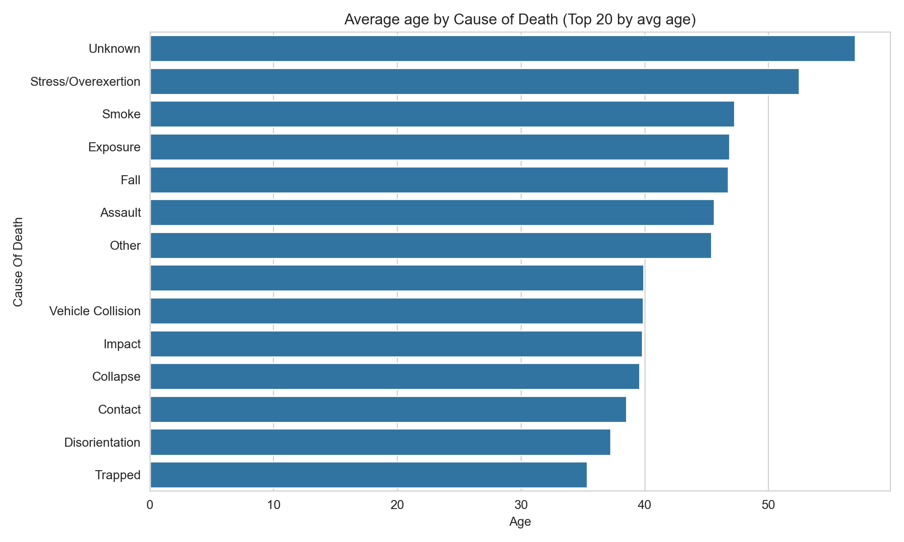

# 🚒 Firefighter Fatalities Analysis

## 📖 Project Overview
This project provides a **comprehensive analysis** of firefighter fatalities using multiple tools and technologies:  

- **SQL Server (SSMS)** → Advanced queries to extract and transform data  
- **Python (Jupyter Notebook)** → Data analysis and visualizations with Pandas, Matplotlib, and Seaborn  
- **Power BI** → Interactive multi-page dashboard for deeper exploration  

The aim of this project is to **identify key risk factors, trends, and patterns** in firefighter fatalities to support data-driven decision-making for safety and prevention.  

---

## 🗄️ Data Source
The dataset includes detailed records of firefighter fatalities such as:  

- Demographics (Name, Age, Rank, Classification)  
- Incident Details (Date of Incident, Date of Death, Duty, Activity, Emergency Status)  
- Cause & Nature of Death  
- Property Type  

---

## 🛠️ Steps & Workflow
1. **SQL Server Analysis**  
   - Wrote more than **15 advanced queries** (aggregations, rolling averages, percentile analysis, time-series breakdowns).  
   - Extracted meaningful KPIs like total fatalities per year, average & median age, top causes of death, and trends over time.  

2. **Python Visualizations**  
   - Imported cleaned data into Pandas.  
   - Built **statistical and exploratory visualizations** using Matplotlib & Seaborn.  
   - Saved plots locally for reporting and inclusion in dashboard.  

3. **Power BI Dashboard**  
   - Designed a **5-page interactive dashboard** with cards, slicers, and visualizations.  
   - Provided insights into **overall trends, causes, duties, activities, and high-risk patterns**.  

---

## 📊 Python Charts & Visualizations
Some of the charts generated in Python and saved under the `outputs/` folder:  

1. **Fatalities by Year with Rolling 5-Year Average** – Shows annual fatalities and smoothed long-term trend.  
   

2. **Age Group Distribution (Histogram + KDE)** – Highlights age groups most at risk.  
   

3. **Top 15 Causes of Death (Bar Chart)** – Identifies leading fatality causes.  
   

4. **Duty × Activity Heatmap** – Shows most hazardous duty-activity combinations.  
   

5. **Emergency vs Non-Emergency Cases (Pie Chart)** – Proportion of fatalities by emergency status.  
   

6. **Monthly Fatalities Seasonality** – Breaks down fatalities by month to reveal seasonal trends.  
   

7. **Same-Day vs Delayed Deaths (Bar Chart)** – Compares immediate vs delayed fatalities.  
   

8. **Nature of Death by Duty (Stacked Bar Chart)** – Visualizes different death types across duties.  
   

9. **Top 20 Activities by Fatalities (Bar Chart)** – Highlights the most fatal activities.  
   

10. **Average Age by Cause (Top 20)** – Compares average age of victims for the top 20 causes.  
    

---

## 📊 Power BI Dashboard Pages
The interactive Power BI dashboard consists of **5 pages**:  

1. **Overview & Summary** – KPIs + general statistics  
2. **Trends Over Time** – Yearly and monthly trends with rolling averages  
3. **Causes of Death** – Focused breakdown of leading causes  
4. **Duty vs Activity** – Comparison of fatalities across different roles  
5. **High-Risk Patterns** – Deep dive into dangerous activities & demographics  

Each page includes **cards, charts, and slicers** to filter by year, duty, activity, and emergency status.  

---

## 📂 Repository Structure
├── data/ # Dataset (CSV/Excel)
├── sql_queries/ # All advanced SQL queries
├── notebooks/ # Jupyter notebooks with Python analysis
├── outputs/ # Saved Python charts (PNG) and CSV results
├── powerbi/ # Power BI dashboard file (.pbix)
└── README.md # Project documentation

---

## ✅ Key Findings
- Most fatalities occurred in the **40–59 age range**.  
- **Stress/Overexertion → Heart Attacks** were leading causes.  
- **Response duties & fireground activities** were the most dangerous combinations.  
- Rolling averages reveal a **gradual decline over recent years**, but spikes remain.  
- Majority of fatalities occurred during **emergencies**.  

---

## 📌 Recommendations
- Increase **health & fitness monitoring** for mid-career firefighters.  
- Improve **safety measures during high-risk activities** (e.g., advancing hose lines, response driving).  
- Focus on **stress management and overexertion prevention programs**.  
- Regular use of **data dashboards** to track ongoing safety performance.  

---

## 🎯 Final Note
This project demonstrates how SQL, Python, and Power BI can be combined to transform raw data into insightful, actionable dashboards that support firefighter safety and policy-making.

---

## 👨‍🚒 Prepared with passion for data-driven safety improvements

***Mohamed Emad Alhadi | Data Analayst***
### contact : ***mohamedemad24649@gmail.com***
